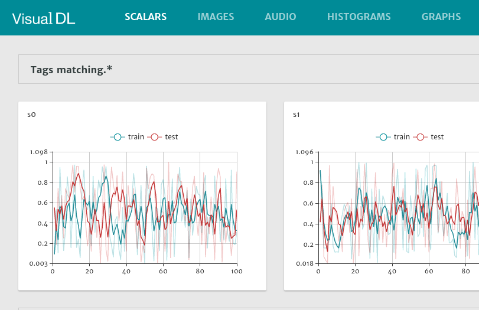
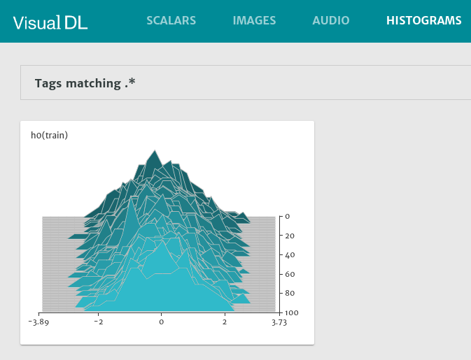
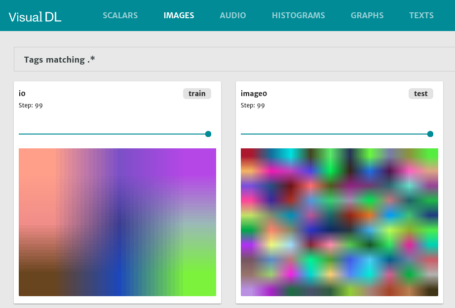

# VisualDL.jl

This package provides a julia wrapper for [VisualDL](https://github.com/PaddlePaddle/VisualDL), which is a deep learning visualization tool that can help design deep learning jobs.

Currently, the wrapper is written on top of the Python SDK of VisualDL by [PyCall](https://github.com/JuliaPy/PyCall.jl). I have tried to write the wrapper on top of the C++ SDK by leveraging [CxxWrap.jl](https://github.com/JuliaInterop/CxxWrap.jl). But unluckily a strange error encountered. Hopefully I'll figured it out later and swap the backend into C++.

## Install

- First, install the Python client of VisualDL. Checkout [here](https://github.com/PaddlePaddle/VisualDL#install-with-virtualenv) for a detailed guide. 

- Then add this package as a dependent.

    `pkg> add https://github.com/findmyway/VisualDL.jl`

## Usage

First, initial the logger.

```julia
using VisualDL

train_logger = VisualDLLogger("tmp", 1, "train")
test_logger = as_mode(train_logger, "test")
```

### Scalar

```julia
for i in 1:100
    with_logger(train_logger) do
        @log_scalar s0=(i,rand()) s1=(i, rand())
    end

    with_logger(test_logger) do
        @log_scalar s0=(i,rand()) s1=(i, rand())
    end
end
```



### Histogram

```julia
for i in 1:100
    with_logger(train_logger) do
       @log_histogram h0=(i, randn(100))
    end
end
```



### Text

```julia
for i in 1:100
    with_logger(train_logger) do
       @log_text t0=(i, "This is test " * string(i))
    end
end
```


### Image

```julia
for i in 1:100
    with_logger(train_logger) do
       @log_image i0=([3,3,3], rand(27) * 255)
    end
end

for i in 1:100
    with_logger(test_logger) do
        @log_image image0=rand(10, 10, 3) * 255
    end
end


# force save and sync
save(train_logger)
save(test_logger)
```



Finally, run `visualDL --logdir ./tmp` in current dir. Then launch the visualdl service and watch the above pictures in browser. The default url is `http://localhost:8040`:


## TODO

- [ ] More documentation
- [ ] Make Release
- [ ] Add `LogReader` and tests
- [ ] Move out the `start_sampling` and `finish_sampling` from `@log_image` and `@log_audio`
